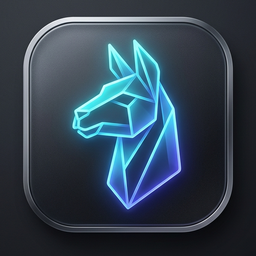

# `ollux` 🦙⚡
> **Ultra-lightweight, native Linux desktop companion for Ollama.**  
> Built with care for the Linux community. Pure Wayland/GTK native performance, deep reasoning controls, live inference benchmarking, and zero Electron bloat.

<p align="center">
  
</p>

<p align="center">
  <a href="https://github.com/AGIQdev-Aditya/ollux"></a>
  <a href="https://github.com/AGIQdev-Aditya/ollux"></a>
  <a href="https://github.com/AGIQdev-Aditya/ollux"></a>
  
  <a href="LICENSE"></a>
</p>

---

## 🙏 A Note from the Creator

> *"Hey everyone! I'm Aditya, a 1st-year computer science student and daily Arch Linux user. I built `ollux` because I love running local AI models with Ollama, but got tired of seeing simple chat wrappers swallow 700MB+ of RAM with Electron or require heavy Docker setups. I wanted something native, fast, respectful of system memory, visually clean with frosted glass, and capable of displaying visual charts and diagrams properly.*  
> *This is an open project built with genuine care for the Linux community. If you run into any bugs or have ideas to make it better, please reach out to me directly — I would love to hear your feedback!"*  
> — **Aditya Sharma** ([@AGIQdev-Aditya](https://github.com/AGIQdev-Aditya))

If you find `ollux` helpful, starring the repository ⭐ on GitHub means a lot!

---

## 💡 Why `ollux`?

Running local LLMs on Linux traditionally forces you into difficult compromises:

| Solution | Disk Space | RAM Footprint | Startup Time | Visual Fidelity & Charts | Linux Native? |
| :--- | :--- | :--- | :--- | :--- | :--- |
| **Open WebUI (Docker)** | ~3.2 GB | ~1,200 – 1,800 MB | 8 – 15 seconds | ✅ Full Web UI | ❌ Web browser inside container |
| **Electron Apps (Jan / LM Studio)** | ~450 – 800 MB | ~550 – 900 MB | 2.5 – 5.0 seconds | ✅ Full UI | ❌ Heavy Chromium bundle wrapper |
| **Terminal CLI (`ollama run`)** | ~0 MB | Minimal | Instant | ❌ **No charts, no SVGs, raw XML, flooded screen** | ⚠️ Text-only terminal shell |
| **`ollux` (Native GTK)** | **< 10 MB** | **~160 – 220 MB total** | **< 0.4 seconds** | **✅ Live SVGs, charts, tables, vision, 1-click copy** | **✅ 100% Native Linux WebKit2GTK** |

### 📊 Why Not Just Use the Terminal (`ollama run`)?
While the CLI is great for quick terminal checks, real AI workflows quickly break down in raw text:
1. **Visual Diagrams & Charts**: Modern coding and reasoning models generate flowcharts, architecture diagrams, and vector art. In a terminal, this prints as hundreds of lines of raw, unreadable `<svg>` markup. `ollux` renders them live as interactive graphics with an instant toggle (`👁️ Preview` / `💻 Code`).
2. **Chain-of-Thought Screen Flooding**: Models like DeepSeek-R1 output extensive `<think>` steps. In a terminal, your entire screen and scrollback buffer get buried under thousands of reasoning tokens. `ollux` automatically folds them into a clean, collapsible drawer with live elapsed timing (`🧠 Reasoned for 3.4s`).
3. **Formatted Tables & Math**: ASCII tables in terminal windows wrap and break on resizing. `ollux` renders crystal-clear Markdown tables and formatted formulas.
4. **Code Extraction**: Copying code from a terminal often captures line wraps, shell prompts, and broken indentation. `ollux` provides syntax-highlighted code blocks with 1-click copy buttons that preserve exact formatting.
5. **Vision & Multimodal Attachments**: Drag-and-dropping PDFs, screenshots, and photos directly into your model with visual thumbnails is impossible in a standard terminal.

`ollux` connects directly to your local Ollama daemon (`http://localhost:11434`) without extra services or telemetry.

---

## ✨ Features

### 🧠 Deep Reasoning & Thinking Controls
- **3-Stage Reasoning Depth Selector**:
  - **Low**: Temperature 0.2, top_p 0.5 (Fast, deterministic answers).
  - **Med**: Temperature 0.6, top_p 0.8 (Balanced analysis).
  - **High**: Temperature 0.85, top_p 0.95 (Deep chain-of-thought exploration).
- **Collapsible Reasoning Drawer**: Parses `<think>...</think>` tokens in real time into an animated accordion with elapsed time indicators (e.g. `🧠 Reasoned for 4.2s`) to keep your reading view clean.

### ⚡ Real-Time Hardware Benchmark Metrics
- Every model response calculates exact live token generation speed:
  $$\text{Tokens / sec} = \frac{\text{eval\_count}}{\text{eval\_duration} \div 10^9}$$
- View total token count, prompt evaluation speed, and duration under every answer.

### 👁️ Multimodal Vision & Smart Attachments
- **Vision Model Auto-Detection**: Visual indicator (`👁️`) automatically identifies multimodal models (`llava`, `moondream`, `llama3.2-vision`, `minicpm-v`).
- **Image Previews**: Paste or drop images with live thumbnail badges in chat bubbles.
- **PDF Extraction**: Ingest and extract documents cleanly via `pypdf` into prompt context.
- **Large Paste Chips**: Pasting long text (>600 characters) automatically collapses into a compact chip (`📄 Pasted Text (x.x KB)`).
- **Native Wayland Drag-and-Drop**: Drag images and PDFs directly from your file manager (Dolphin, Nautilus, Thunar) into the window.

### 🎨 Frosted Glass & Dynamic Compositor Fallback
- **macOS-Grade Frosted Glass**: Dynamic translucency and specular illumination on Wayland (Hyprland, Sway, GNOME, KDE) and composited X11.
- **Dynamic Compositor Detection**: Automatically tests for `screen.is_composited()`:
  - On composited desktops: Renders rich frosted glass.
  - On non-composited X11 (XFCE with compositing off, i3/Openbox without picom, VMs): Automatically engages a solid high-contrast dark theme without black rectangles, tearing, or software blur lag.

### 📊 Inline SVG Graphics Preview
- Offline models that generate vector art or SVG diagrams feature an inline toggle button (`👁️ Preview` / `💻 Code`), rendering graphics live inside the chat.

### 📋 1-Click Code & Full Response Copy
- Code blocks include syntax highlighting and 1-click copy.
- Assistant responses include a full Markdown copy button with animated visual checkmark feedback.

### 🌐 Privacy-First Web Grounding
- Optional DuckDuckGo search integration that enriches queries with live web citations without requiring API keys or tracking user identity.

### 💾 100% Private SQLite Storage
- Chat sessions, messages, and settings stored locally at `~/.local/share/ollux/ollux.db`.
- SQLite WAL mode with synchronous durability and a memory page cache ceiling capped at 4MB (`PRAGMA cache_size = -4000;`).

---

## 🖥️ Desktop Environment Compatibility

| Environment | Compositor | Translucency | Fallback Mode |
| :--- | :--- | :--- | :--- |
| **Hyprland, Sway, River, niri** | Wayland | ✅ Frosted Glass | Tiling supported down to 740x520 min boundary |
| **GNOME 40+ (Wayland / X11)** | Mutter | ✅ Frosted Glass | System dark theme auto-detection |
| **KDE Plasma 5 & 6 (Wayland / X11)** | KWin | ✅ Frosted Glass | Dynamic backdrop diffusion |
| **Ubuntu Unity & Cinnamon** | Compiz / Muffin | ✅ Frosted Glass | Native window decorations |
| **XFCE (Xfwm4 Compositing)** | Xfwm4 | ✅ Frosted Glass | Native lightweight performance |
| **XFCE / i3 / Openbox (No Compositor)** | None | 🛡️ Solid Dark Fallback | Automatic zero-glitch solid dark palette |

---

## ⌨️ Desktop Keyboard Shortcuts

| Shortcut | Action |
| :--- | :--- |
| <kbd>Ctrl</kbd> + <kbd>N</kbd> | Start New Conversation |
| <kbd>Ctrl</kbd> + <kbd>K</kbd> | Focus Conversation Search Bar |
| <kbd>Ctrl</kbd> + <kbd>B</kbd> | Toggle Sidebar (Expand / Collapse) |
| <kbd>Ctrl</kbd> + <kbd>Shift</kbd> + <kbd>C</kbd> | Copy Latest Assistant Response |
| <kbd>Esc</kbd> | Close Modal / Cancel Generation |
| <kbd>Enter</kbd> | Send Message |
| <kbd>Shift</kbd> + <kbd>Enter</kbd> | Insert Line Break |

---

## 🚀 Installation

### Option 1: Universal 1-Line Installer (Recommended)
Installs `ollux` natively with desktop icon, application menu entry, and path launcher on **Arch, Ubuntu, Debian, Linux Mint, and Fedora**:

```bash
curl -sSL https://raw.githubusercontent.com/AGIQdev-Aditya/ollux/master/install.sh | bash
```

---

### Option 2: Arch Linux / Manjaro / EndeavourOS

**Direct Pacman Installation (Instant pre-built binary package):**
```bash
sudo pacman -U https://github.com/AGIQdev-Aditya/ollux/releases/download/v0.1.0/ollux-0.1.0-1-any.pkg.tar.zst
```

**Build with `makepkg` (Source):**
```bash
git clone https://github.com/AGIQdev-Aditya/ollux.git
cd ollux
makepkg -si
```

**Via AUR (`yay` / `paru`) — *Coming Soon*:**
> ⚠️ **Note on AUR:** New AUR account registrations are temporarily paused by Arch Linux administrators due to anti-spam maintenance. As soon as registrations reopen, `ollux` will be live on the AUR. In the meantime, please use the **Direct Pacman Installation** or **`makepkg -si`** above!

```bash
# Will be active once AUR registration reopens:
yay -S ollux
# or
paru -S ollux
```

---

### Option 3: Debian / Ubuntu / Linux Mint / Pop!_OS

1. **Install system dependencies**:
```bash
sudo apt update
sudo apt install -y python3 python3-pip python3-venv python3-gi \
    gir1.2-webkit2-4.1 gir1.2-gtk-3.0 python3-requests python3-pypdf
```

2. **Clone and run**:
```bash
git clone https://github.com/AGIQdev-Aditya/ollux.git
cd ollux
python3 -m venv --system-site-packages .venv
source .venv/bin/activate
pip install pywebview ddgs
./run.sh
```

---

### Option 4: Fedora / RHEL / Nobara

1. **Install system dependencies**:
```bash
sudo dnf install -y python3 python3-gobject webkit2gtk4.1 gtk3 \
    python3-requests python3-pypdf
```

2. **Clone and run**:
```bash
git clone https://github.com/AGIQdev-Aditya/ollux.git
cd ollux
python3 -m venv --system-site-packages .venv
source .venv/bin/activate
pip install pywebview ddgs
./run.sh
```

---

### Option 5: Run Locally Anywhere (Portable)

Ensure you have [Ollama](https://ollama.com/) running (`ollama serve` or `sudo systemctl start ollama`).

```bash
git clone https://github.com/AGIQdev-Aditya/ollux.git
cd ollux
./run.sh
```

---

## 🏗️ Architecture Overview

```text
┌────────────────────────────────────────────────────────┐
│                      OLLUX GUI                         │
│   WebKit2GTK 4.1 / PyWebView 5.x (Wayland & X11)       │
│   Adaptive Dark Glass · Highlight.js · DOMPurify       │
└───────────────────────────▲────────────────────────────┘
                            │ Two-way Native JSON-RPC IPC
┌───────────────────────────▼────────────────────────────┐
│                    OLLUX CORE ENGINE                   │
│   Python 3.10+ (GIL-conscious async worker threads)    │
│   ├── Ollama Client (Streaming, Model Hub, Tags)       │
│   ├── Attachment Handler (PDF extraction, Base64)      │
│   ├── Privacy Web Search (DuckDuckGo integration)      │
│   └── SQLite WAL Storage (~/.local/share/ollux/)       │
└───────────────────────────▲────────────────────────────┘
                            │ REST / SSE (Port 11434)
┌───────────────────────────▼────────────────────────────┐
│              LOCAL OLLAMA DAEMON (Ollama)              │
└────────────────────────────────────────────────────────┘
```

---

## 💬 Feedback, Feature Requests & Getting in Touch

I genuinely want to hear from you! Whether you have an idea for a feature, ran into a bug on your specific distro/window manager, or just want to chat about local AI on Linux:

- **Email me directly**: [agiq.dev@gmail.com](mailto:agiq.dev@gmail.com) — *I read and reply to every email!*
- **Open a GitHub Issue**: For bugs or feature requests: [github.com/AGIQdev-Aditya/ollux/issues](https://github.com/AGIQdev-Aditya/ollux/issues)
- **Start a Discussion**: Share your thoughts, ask questions, or discuss setups: [github.com/AGIQdev-Aditya/ollux/discussions](https://github.com/AGIQdev-Aditya/ollux/discussions)
- **Pull Requests**: Community improvements, bugfixes, and ideas are always welcome!

---

## 👤 Author

**Aditya Sharma**
- GitHub: [@AGIQdev-Aditya](https://github.com/AGIQdev-Aditya)
- Email: [agiq.dev@gmail.com](mailto:agiq.dev@gmail.com)
- 1st Year B.Tech Computer Science student & Linux enthusiast.
- Project: Official open-source Linux client for Ollama.

---

## 📄 License & Open-Source Rights

This project is licensed under the **GNU General Public License v3.0 (GPLv3)** — see the [LICENSE](LICENSE) file for complete legal terms.

- **You are free to**: Use, run, inspect, and modify `ollux` for personal or community use.
- **You are required to**: Keep all author attributions intact (`Copyright (C) 2026 Aditya Sharma`). Any derivative work or redistribution must remain 100% open-source under GPLv3.
- **Strictly prohibited**: Taking this code, closing the source, or redistributing it as a commercial paid product or under a different author's name.

*Keep software free and open. Keep computing local.*
