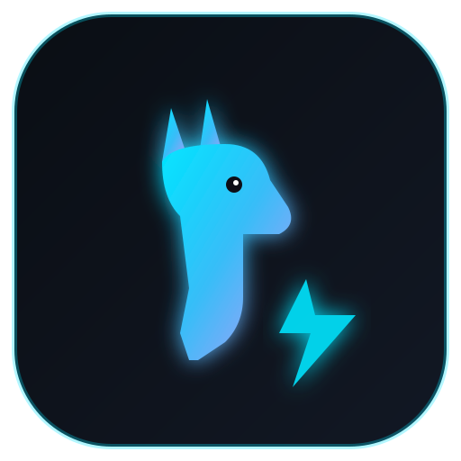

# `ollux` 🦙⚡
> **Ultra-lightweight, native Linux desktop companion for Ollama.**  
> Zero Docker. Zero Electron bloat. Pure Wayland/GTK native performance with deep reasoning controls and live inference benchmarking.

<p align="center">
  
</p>

<p align="center">
  
  
  
  
  
</p>

---

## 💡 Why `ollux`?

Running local LLMs on Linux usually forces you to choose between two bad compromises:
1. **Open WebUI in Docker**: Consumes 3GB of disk and 1.5GB of RAM idle just to show a chat interface.
2. **Jan / LM Studio**: 500MB+ Electron bundles that drain battery life and feel sluggish on tiling window managers like Hyprland, Sway, and i3.
3. **Terminal `ollama run`**: Great for quick tests, but lacks image pasting, PDF ingestion, reasoning toggles, and token speed counters.

**`ollux` solves this.** Built with Python and native WebKit2GTK, it starts in under 0.4 seconds, idles at **<50MB RAM**, and talks directly to your existing Ollama instance (`localhost:11434`).

---

## ✨ Features

- **⚡ Instant Plug-and-Play**: Automatically detects your already installed models (`GET /api/tags`) in $<50\text{ms}$. Zero forced onboarding downloads.
- **🧠 Thinking Strength Controller**: 3-stage reasoning budget selector:
  - **Low**: Temperature 0.2, top_p 0.5 (Fast, direct answers).
  - **Med**: Temperature 0.6, top_p 0.8 (Balanced analysis).
  - **High**: Temperature 0.85, top_p 0.95 (Deep chain-of-thought exploration).
- **📦 Collapsible Reasoning Drawer**: Parses `<think>...</think>` tokens in real-time into an animated accordion (`🧠 Reasoned for 3.4s`) to keep your reading view clean.
- **🚀 Real-Time Speed Benchmarks**: Calculates exact hardware inference speed under every response:
  $$\text{Tokens/sec} = \frac{\text{eval\_count}}{\text{eval\_duration} \div 10^9}$$
- **📁 Smart Attachments**:
  - **Vision Models**: Drop or paste images (`.png`, `.jpg`, `.webp`) to automatically encode and send to vision-enabled models (e.g. `qwen3.8:27b`).
  - **PDF Documents**: Clean text extraction via `pypdf` injected into prompt context.
  - **Auto-Collapsed Large Pastes**: Pasting text $>600$ characters automatically converts into a compact `📄 Pasted Text (x.x KB)` chip.
- **🌐 Privacy-First Web Search**: Toggle keyless DuckDuckGo search to ground responses with live web citations without API keys or tracking.
- **💾 Local SQLite History**: 100% private conversation sessions and memory saved at `~/.local/share/ollux/ollux.db`.
- **🎨 TokyoNight Dark Glassmorphism**: High-contrast, crystal-clear typography, syntax highlighting with 1-click code copying, and native Wayland scaling.

---

## 🛠️ Quick Start

### Option A: Arch Linux (AUR)
```bash
# Using yay
yay -S ollux

# Or using paru
paru -S ollux
```

### Option B: Clone & Run (Any Linux Distro)
Ensure you have `ollama` running (`sudo systemctl start ollama` or `ollama serve`).

```bash
# 1. Clone repository
git clone https://github.com/AGIQdev-Aditya/ollux.git
cd ollux

# 2. Run setup script
python3 -m venv .venv
source .venv/bin/activate
pip install -r requirements.txt

# 3. Launch ollux
./run.sh
```

---

## 🏗️ Architecture

```
┌────────────────────────────────────────────────────────┐
│                      OLLUX GUI                         │
│   Webkit2GTK / PyWebView (Wayland / Hyprland Native)   │
│   TokyoNight Theme + Highlight.js + Marked (Offline)   │
└───────────────────────────▲────────────────────────────┘
                            │ Two-way Python IPC
┌───────────────────────────▼────────────────────────────┐
│                    OLLUX CORE ENGINE                   │
│   Python 3.12+                                         │
│   ├── Ollama Client (Streaming, Tags, Pull, Delete)    │
│   ├── Attachment Processor (pypdf, Base64 vision)      │
│   ├── Privacy Web Search (DuckDuckGo integration)      │
│   └── SQLite Engine (~/.local/share/ollux/ollux.db)    │
└───────────────────────────▲────────────────────────────┘
                            │ REST / SSE
┌───────────────────────────▼────────────────────────────┐
│              LOCAL OLLAMA DAEMON (Port 11434)          │
└────────────────────────────────────────────────────────┘
```

---

## 👤 Author

**Aditya Sharma**  
- GitHub: [@AGIQdev-Aditya](https://github.com/AGIQdev-Aditya)  
- Student: 1st Year B.Tech Computer Science & Engineering  
- OS: Arch Linux (Hyprland / Wayland)

---

## 📄 License
This project is open-source under the [MIT License](LICENSE).
